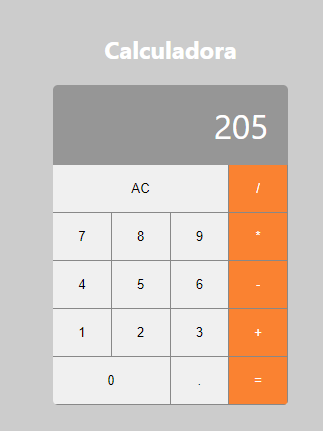

# Projeto Calculadora com o ReactJS

Este projeto é uma calculadora desenvolvida com o ReactJS. O objetivo desse pequeno projeto é estudar a parte de componentização, entender melhor como o React funciona e aplicar meus conhecimentos. 

## Para rodar o projeto

Para rodar este projeto é necessário ter o node instalado na sua máquina. 

clone o projeto: 

`git clone https://github.com/DevRafaelLima/calculadora-com-reactjs`

Dentro do diretório do projeto abra seu terminal e execute o seguinte comando para baixar as depedências necessárias.

`npm -i`

Concluido esse processo, agora é só executar o projeto com o comando: 

`npm start`
